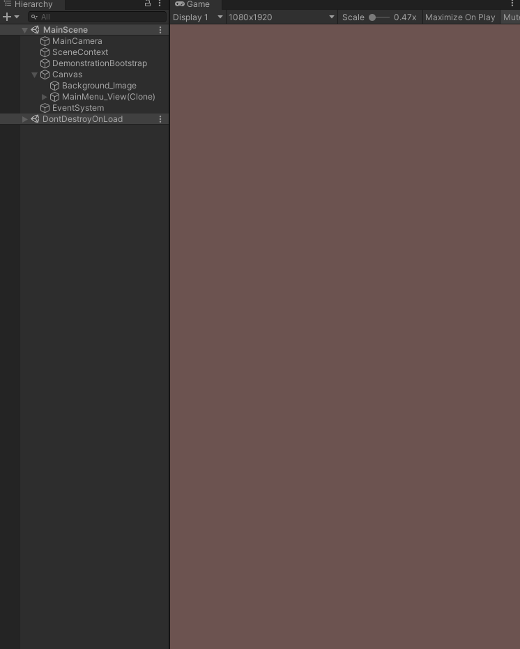

# mvc_test (Unity 2020.3.30f1) + Zenject + UniRx
## Что реализовано

### MVC
- `M` слой представлен `WindowModelBase.cs`. Он принимает на вход данные и делает из них реактивные проперти, чтобы `V` слой мог на них подписаться.
- `V` слой представлен `WindowViewBase.cs`. Он инкапсулирует в себе модель, подписывается на ее обновления и отображает изменения пользователю.
- `C` слой представлен  `WindowControllerBase.cs` и `WindowInputAdapterBase.cs`. По паттерну MVC входные данные от пользователя должны поступать в контроллер, плюс контроллер и вью не имеют непосредственной связи. Насколько я понял многие наследуют контроллер от MonoBehavior чтобы получать пользовательский ввод, но мне как-то непонравилось это решение, поэтому я реализовал `WindowInputAdapterBase.cs`, который является MonoBehavior, он инджектит в себя котроллер и передает ему пользовательский ввод.

### Окна
- В тестовом задании представлено два окна. Основное MainWindow и окно с оффером OfferWindow.
- Основное окно открывается при запуске игры.
- Окно оффера открывается из основного окна.
- Соданием всего необходимого для существования окон занимаются фабрики, они создают модели, контроллеры, спавнять префабы.
- UIService реализован в упрощенном формате. Единовременно может существовать только одно окно, предыдущее окно уничтожается. В реальном проекте нужно было бы поддерживать существование иерархии окон, а так же нужно было бы создать пул окон, чтобы не уничтожать и не создавать объекты каждый раз.
- Взаимодействие окон с "внешним миром" реализовано через `UIService`. На примере с вызовом окна OfferWindow из окна MainWIndow это выглядит примерно так: Нажатие на кнопку пользователем в MainWindow -> `MainWindowInputAdapter` получает нажатие кнопки и вызывает метод `MainWindowController` -> `MainWindowController` вызывает метод `UIService` -> `UIService` открывает другое окно.

### Верстка
- Сверстаны два окна и сохранены в виде префабов.
- Какой-то адаптивности для окон не реализовывал. Т.е. они не подгоняются под разрешения и соотношения.

## Мысли
- По паттерну основная фукнция контроллера получать ввод и обновлять модель, но в данном тестовом выходит так, что нет никакого ввода от пользователя, который обновлял бы модель текущего окна.
- Данные `IWindowData` которые получает на вход модель создаются просто так через new. По хорошему в реальном проекте должна быть какая-то иерархия провайдеров, которые могли бы выдавать данные из всех интересующих нас мест: с UI, из репозиториев, с сервера и т.п.
- В тестовом было задание:
> Должно быть реализовано соответствие название иконок с их спрайтами (возможно через ScriptableObject)

	Не совсем понял зачем это нужно. Вроде как у спрайтов в проекте уже есть название, которое их однозначно идентифицирует. Может быть имелось ввиду соответствие предметов с их спрайтами?
В итоге там сделано так, что для ресурсов реализовано соответсвие с иконками. А основная иконка окна просто получается по своему имени файла, потому что в задании так и написано:
> Входные параметры окна извне:		
...
Название большой иконки окна

## Другое
- На выполнение тестового потрачено около 2х дней.
- Стартует проект из монобеха Demonstration, который не является какой-то частью архитектурного решения, он просто открывает основное окно в целях демонстрации.
- В тестовом есть задание:
> Для проверки задания сделать стартовый экран в виде: кнопка на экране, которая будет вызывать данное окно, поле ввода количества предметов в окне

	Не очень понял какое именно количество должно принимать на вход это поле. Ведь у нас в окне может быть разное количество стаков предметов, плюс сами стаки могут содержать разное количество предметов.
В итоге я сделала поле, которое принимает на вход количество стаков. А то, какие это именно будут стаки, и какое в них будет количество предметов определяется рандомно при помощи метода затычки в демонстрационных целях.

## Демонстрация работы

